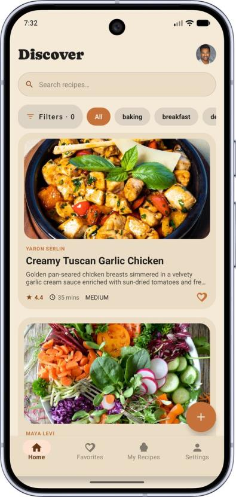
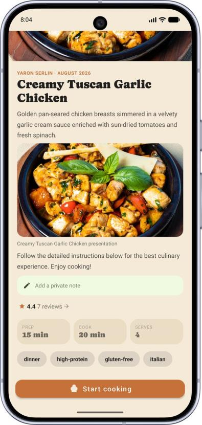
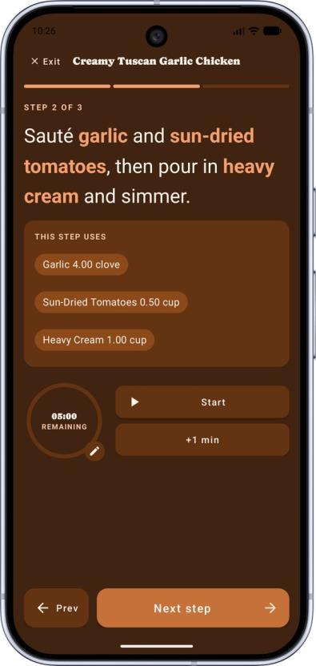
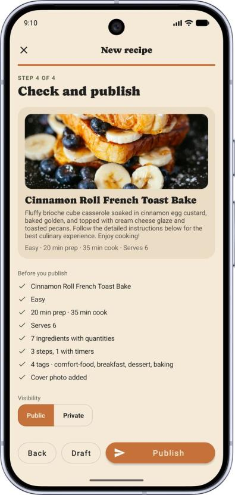

<p align="center">
  
</p>

<h1 align="center">CookSync</h1>

<p align="center">
  <a href="https://github.com/yaronserlin/cook-sync/actions/workflows/onPush.yml"></a>
  <a href="https://github.com/yaronserlin/cook-sync/releases/latest"></a>
  
  
  <a href="LICENSE"></a>
</p>

<p align="center">
  <a href="https://yaronserlin.github.io/cook-sync/"><b>Project page</b></a> ·
  <a href="https://github.com/yaronserlin/cook-sync/releases/latest/download/CookSync.apk"><b>Download APK</b></a> ·
  <a href="docs/user-guide.md"><b>User guide</b></a> ·
  <a href="docs/functional-spec.md"><b>Functional spec</b></a>
</p>

A mobile (Android) app for sharing and discovering cooking recipes. Users browse and search recipes, save favorites, write personal notes on preparation steps, follow a guided step-by-step "Cooking Mode" with timers, rate and review recipes, and create/publish their own recipes through a guided 4-step wizard. Admin users get a moderation console for managing users, tags, measurement units, and reported reviews.

This file is self-contained: it covers everything needed to build, run, and understand the project as a whole. Each module below also has its own standalone README with module-specific detail.

## Try it

<table>
<tr>
<td valign="top">

**On your phone** — scan the QR code, or [download the APK directly](https://github.com/yaronserlin/cook-sync/releases/latest/download/CookSync.apk). Every push to `main` publishes a freshly built, signed APK to the [`latest-apk`](https://github.com/yaronserlin/cook-sync/releases/tag/latest-apk) release, so that link is always the current build.

Android blocks installs from outside the Play Store by default — allow "Install unknown apps" for your browser when prompted. Requires **Android 7.0 (API 24)** or newer.

The release build talks to the hosted API, so there's nothing to set up. The API sleeps when idle, so the very first request after a quiet spell can take up to a minute; everything after that is fast.

</td>
<td width="180" align="center" valign="top">

<br><sub>Latest APK</sub>
</td>
</tr>
</table>

New to the app? The [user guide](docs/user-guide.md) walks through every screen.

## Screenshots

| Home | Recipe | Cooking Mode | Publish a recipe |
|---|---|---|---|
|  |  |  |  |

Every screen is shown in the [user guide](docs/user-guide.md).

## Documentation

Every document is also published on the [project site](https://yaronserlin.github.io/cook-sync/), rendered from these same files.

| Document | Read online | What it covers |
|---|---|---|
| [User guide](docs/user-guide.md) | [↗](https://yaronserlin.github.io/cook-sync/user-guide.html) | Using the app, screen by screen — accounts, search, Cooking Mode, publishing a recipe, settings, admin console |
| [Functional specification](docs/functional-spec.md) | [↗](https://yaronserlin.github.io/cook-sync/functional-spec.html) | Actors, functional areas, domain model, business rules, external services, API surface |
| [Documentation index](docs/README.md) | — | Everything written about the project, in one place, and how the site is built |
| Privacy policy · Terms of use | [↗](https://yaronserlin.github.io/cook-sync/privacy.html) · [↗](https://yaronserlin.github.io/cook-sync/terms.html) | Legal documents, also shown inside the app |
| Hebrew originals (PDF) | — | The [user guide](docs/pdf/cooksync-user-guide-he.pdf) and [functional document](docs/pdf/cooksync-functional-document-he.pdf) as submitted |

## Repository layout

| Module | Description |
|---|---|
| [`cook-sync-client`](cook-sync-client) | The Android app (Java, MVVM) |
| [`cook-sync-server`](cook-sync-server) | The REST backend (Spring Boot) |
| [`cooksync-DTOs`](cooksync-DTOs) | Shared DTO library used by both client and server |

## Main technologies

**Client (Android, Java 17):** Retrofit + OkHttp + Gson, MVVM with `ViewModel`/`LiveData`, Glide / Cloudinary Android SDK / Fresco / PhotoView for images, `androidx.security` for encrypted local session storage.

**Server (Java 21, Spring Boot 3.4.2):** Spring Web, Spring Data JPA + MySQL, Spring Security + JJWT (stateless JWT auth), Flyway for schema migrations, Cloudinary SDK, Gmail API (OAuth2, HTTPS) for transactional email, Lombok.

**Shared:** `cooksync-DTOs` — a small Maven module holding every request/response class, installed locally (`mavenLocal()`) and consumed identically by both sides.

## Running locally — quick start

The project has three modules that must be built/run in order: the shared DTOs library first, then the server, then the client.

```bash
# 1. Create an empty MySQL database
mysql -u root -p -e "CREATE DATABASE cooksync_db;"

# 2. Build the shared DTOs library and install it locally
cd cooksync-DTOs && mvn install && cd ..

# 3. Create a .env file in cook-sync-server (see cook-sync-server/README.md for the full variable table)
#    JWT_SECRET is required; DB_URL/DB_USERNAME/DB_PASSWORD, GOOGLE_OAUTH_*
#    and CLOUDINARY_* can be tuned for your local environment.

# 4. Run the server (Flyway applies the schema migrations automatically)
cd cook-sync-server && ./mvnw spring-boot:run
```

Once the server is running, open `cook-sync-client` in Android Studio, confirm that `BASE_URL` (in `app/build.gradle.kts`) points to the right server address (`http://10.0.2.2:8080/` for the emulator, or your machine's local IP for a physical device), and run the app.

### Running the server with Docker (alternative)

Instead of installing MySQL locally and running Maven by hand, the server and its database can run in containers via Docker Compose:

```bash
cp .env.example .env   # fill in JWT_SECRET and CLOUDINARY_* at minimum
./docker-up.sh
```

This builds `cooksync-DTOs` and `cook-sync-server` inside the image and starts MySQL alongside it (Flyway still applies schema migrations automatically on startup). The API is reachable at `http://localhost:8080` (or `http://10.0.2.2:8080/` from the Android emulator). See `.env.example` for the full list of variables.

Add `--seed` to wipe and repopulate the database with the demo dataset (30 recipes, 15 users) on startup — `./docker-up.sh --seed`. Without it, the server starts normally with whatever data is already in the database.

To sign in against a locally seeded database, use any of the accounts created by the seeder — e.g. `chef@cooksync.com` / `Password123!` for a regular user, or `admin@cooksync.com` / `Password123!` to see the admin console. These are **local demo accounts only**: the seeder is gated behind the `seed` profile and never runs in production, so these credentials do not exist on the hosted API — there, register a fresh account.

## License

Released under the [MIT License](LICENSE).
